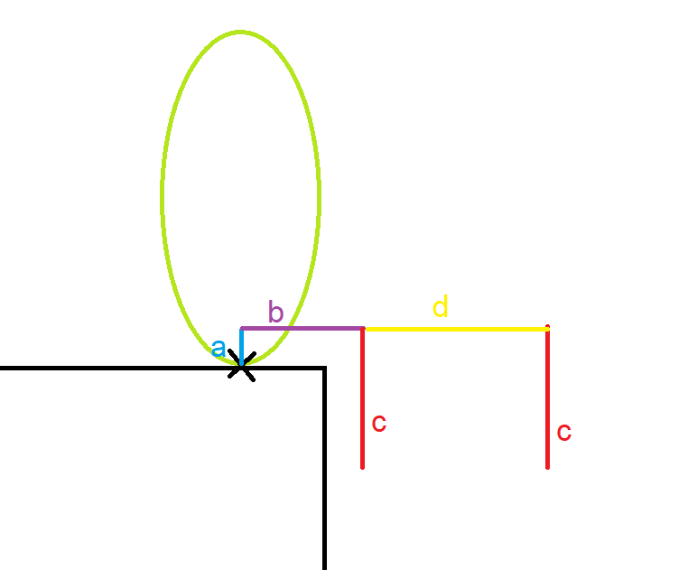

# Prevent Grounding Based on Slope Angle Changes

There are times when you might want your character to not be grounded when moving off of a ledge into emptiness, or not be grounded when going over a certain downward change in slope angle (so your character can "launch" off the slope instead of sticking to it). 

The default generated character comes with parameters for this:
* `PreventGroundingWhenMovingTowardsEmptiness`: prevents sticking to the ground when moving off of a ledge into emptiness
* `HasMaxDownwardSlopeChangeAngle`: prevent sticking to the ground when moving over a downward slope change
* `MaxDownwardSlopeChangeAngle`: max angle in degrees where we can stick to the ground when moving over a downward slope change

These fields are used in your character processor in `IsGroundedOnHit`. `KinematicCharacterUtilities.DefaultMethods.DetectFutureSlopeChange` is called here, and it handles detecting how the slope angle will change ahead of the character, and whether or not the character is heading towards the empty (falling) side of a ledge. Here's a depiction of what it does:

a, b, c, d represent raycasts that are done by the method. The length of each raycast is calculated like so:
* a: this is the `verticalOffset` parameter of the method
* b : this is the result of the `deltaTimeIntoFuture` parameter of the method, multiplied by the length of our character velocity
* c : this is the `downDetectionDepth` parameter of the method
* d : this is the `secondaryEmptinessCheckDistance` parameter of the method

The "b" raycast will attempt to detect any obstruction forward. It if hit something, we calculate the positive (upward) `futureSlopeChangeAnglesRadians` between our grounding and the hit slope. If not, we go ahead with the first "c" raycast. If this raycast hits something, we calculate the negative (downward) `futureSlopeChangeAnglesRadians` between our grounding and the slope. If we were not grounded on that hit, or if we didn't hit anything, we determine that we are moving towards emptiness and we set the `isMovingTowardsEmptiness` out parameter to true. Finally, if `isMovingTowardsEmptiness` is true at this point, we do a second "c" raycast further ahead, to make sure our first "c" raycast didn't just happen to go through a small crack in the ground. If the second "c" raycast finds a grounded hit, we reassign `isMovingTowardsEmptiness` to false