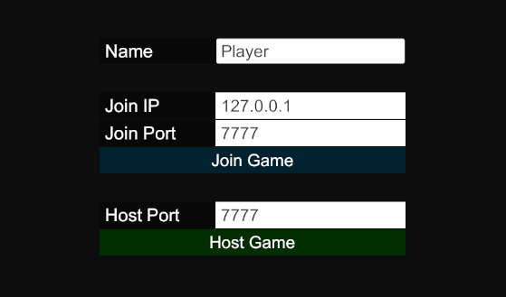

Back to [Samples](../../samples.md)

# OnlineFPS Sample - Hosting & Connecting

In order to play the OnlineFPS, you need to either host a game, or connect to a game. This is done through the menu in the "OnlineFPSMenu" scene.

## Building the project

To build the game, navigate to the "BuildConfig" folder under the "Sample_OnlineFPS" folder, find the config named "OnlineFPSClientServerBuildConfig", and press "Build" in the top right.

## Hosting a game

To host a game, you need to specify a port on which to listen to connections ("Host Port"), and then click the "Host Game" button. This will start a server for the game, as well as a local client for you to play as.

NOTE 1: When hosting a game, if you want others to be able to connect, it is important that you **forward the port** you specified as you "Host Port" in your router settings. The exact procedure varies depending on the router. If you don't know how to do it, search for "port forwarding" + the brand of router you have.

NOTE 2: If people still can't connect to your game even after forwarding the port, consider allowing the build .exe through the firewall, or temporarily deactivating your firewall.

## Connecting to a game

To connect to a game/server, you must enter the IP and port of the desired server in the "Join IP" and "Join Port" fields. Once this is done, press the "Join Game" button.

The "Join IP" is the public IP of the server. You can get the public IP by going to [https://www.whatismyip.com/](https://www.whatismyip.com/) on the computer that is hosting the game. However, if you try playing by launching multiple builds on the same machine, the "Join IP" should always be "127.0.0.1"

The "Join Port" is the port that the server specified as their "Host Port".