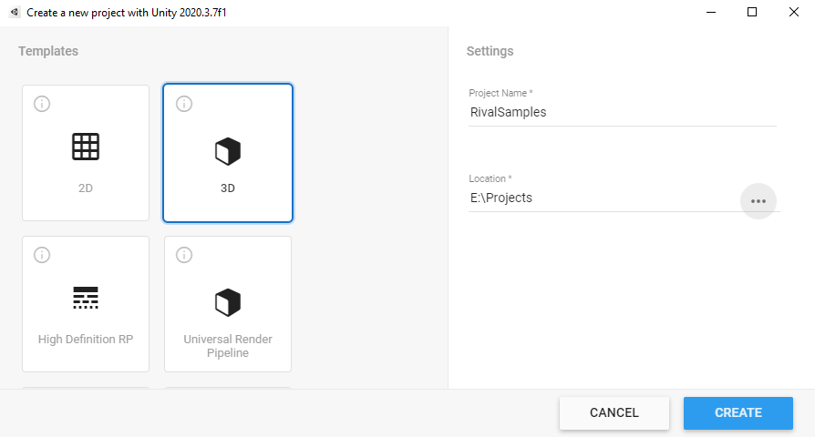
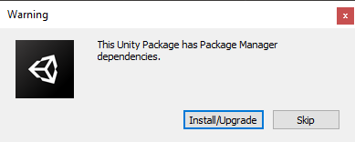
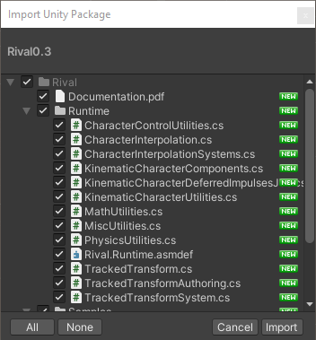
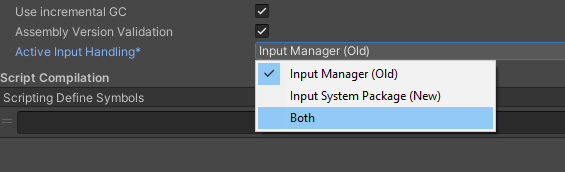
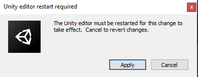
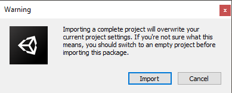
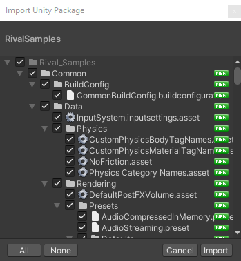

# Samples - How to Install

Here are the steps required in order to install the Rival Samples project:

**WARNING: this will completely overwrite the project settings and dependencies. Make sure you do this in a new empty project!**

* Create a completely new Unity project, using the “3D” template. You can call this project “RivalSamples” for example. The starting template we choose here does not matter much, because all of the project settings will be overwritten by the Samples unitypackage later.

* Import the Rival package into this project. 
* A popup will appear saying this package has dependencies: click "Install/Upgrade"

* Wait for the importing/compilation to finish 
* A popup will let you import the Rival files. Make sure all files are selected, and click "Import"

* Wait for the importing/compilation to finish 
* In “Edit > Project Settings > Player”, set the “Active Input Handling” to “Both”. 

* A popup will appear saying the editor must be restarted. Click "Apply" to restart (it is important to restart now before going any further)

* After the restart, go to the “Assets/Rival/Samples” folder, and open “RivalSamples.unitypackage” by double-clicking on it inside Unity's "Project" window. 
* A popup will appear saying this package will overwrite all project settings: click "Import"

* A popup will appear saying this package has dependencies: click "Install/Upgrade"

* A popup will let you import the RivalSamples files. Make sure all files are selected, and click "Import"

* Wait for the importing/compilation to finish 
* At this point, restart Unity
* Once restarted, you can find all samples under the “Rival_Samples” folder, and you're done!

------------------------------ 

NOTE 1: If after these steps, you still don’t see the “Rival_Samples” folder in your project, simply restart Unity again and try to reopen the “RivalSamples.unitypackage” again. This is most likely due to the import process being blocked or interrupted by other import/compilation processes.

NOTE 2: If you are seeing anything that isn't working properly after importing the Samples (invalid shaders, subscenes not loading, etc...), try exiting Unity, and deleting the "Library" folder (the one next to your project's "Assets" folder). This will cause Unity to cleanly reimport everything the next time you open the project, and it often solves these issues.

NOTE 3: "RivalSamples.unitypackage" does not actually include the core Rival files. If you install the samples in a different way than what is described here, you must keep this in mind, and import "Rival" on top of the samples package.