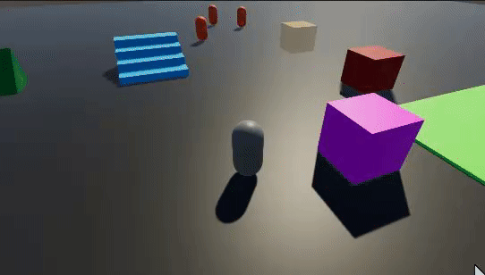

Back to [Tutorial](../tutorial.md)

# Tutorial - AI Character

We will now go over the implementation of very rudimentary AI characters. We want to have characters that detect human-controlled characters at a distance, and start moving towards them as long as they are in their detection range. We will also demonstrate how we can structure things so that we don't have to create an entirely new character controller for AIs, and we can simply reuse the same that our player character uses.

Let's first create our `AIController` component:
```cs
using System;
using Unity.Collections;
using Unity.Entities;
using Unity.Mathematics;
using Unity.Physics;
using Unity.Physics.Authoring;

[Serializable]
[GenerateAuthoringComponent]
public struct AIController : IComponentData
{
    public float DetectionDistance;
    public PhysicsCategoryTags DetectionFilter;
}
```

And now the `AIControllerSystem`:
```cs
using Unity.Burst;
using Unity.Collections;
using Unity.Entities;
using Unity.Jobs;
using Unity.Mathematics;
using Unity.Physics;
using Unity.Physics.Systems;
using Unity.Transforms;
using Rival;

public partial class AIControllerSystem : SystemBase
{
    protected override void OnUpdate()
    {
        PhysicsWorld physicsWorld = World.GetOrCreateSystem<BuildPhysicsWorld>().PhysicsWorld;

        NativeList<DistanceHit> distanceHits = new NativeList<DistanceHit>(Allocator.TempJob);

        Entities
            .WithDisposeOnCompletion(distanceHits) // Dispose the list when the job is done
            .ForEach((ref ThirdPersonCharacterInputs characterInputs, in AIController aiController, in ThirdPersonCharacterComponent character, in Translation translation) =>
            {
                // Clear our detected hits list between each use
                distanceHits.Clear();

                // Create a hit collector for the detection hits
                AllHitsCollector<DistanceHit> hitsCollector = new AllHitsCollector<DistanceHit>(aiController.DetectionDistance, ref distanceHits);

                // Detect hits that are within the detection range of the AI character
                PointDistanceInput distInput = new PointDistanceInput
                {
                    Position = translation.Value,
                    MaxDistance = aiController.DetectionDistance,
                    Filter = new CollisionFilter { BelongsTo = CollisionFilter.Default.BelongsTo, CollidesWith = aiController.DetectionFilter.Value },
                };
                physicsWorld.CalculateDistance(distInput, ref hitsCollector);

                // Iterate on all detected hits to try to find a human-controlled character...
                Entity selectedTarget = Entity.Null;
                for (int i = 0; i < hitsCollector.NumHits; i++)
                {
                    Entity hitEntity = distanceHits[i].Entity;

                    // If it has a character component but no AIController component, that means it's a human player character
                    if (HasComponent<ThirdPersonCharacterComponent>(hitEntity) && !HasComponent<AIController>(hitEntity))
                    {
                        selectedTarget = hitEntity;
                        break; // early out
                    }
                }

                // In the character inputs component, set a movement vector that will make the ai character move towards the selected target
                if (selectedTarget != Entity.Null)
                {
                    characterInputs.MoveVector = math.normalizesafe((GetComponent<Translation>(selectedTarget).Value - translation.Value));
                }
                else
                {
                    characterInputs.MoveVector = float3.zero;
                }
            }).Schedule();
    }
}
```

Note: you could also choose to make the AI detection zones work with trigger colliders instead of a `CalculateDistance` query, if you prefer that approach.

Now you can create a copy of your character object in the Subscene, name it "AICharacter", and add an `AIController` component to it. Set the `DetectionDistance` to 8 for example, and the `DetectionFilter` to "Everything". 

If you press Play, and go near the AICharacter, it should start chasing you.



See [Navmesh](../How_To/navmesh.md) for suggestions on how to use Navmeshes with Rival