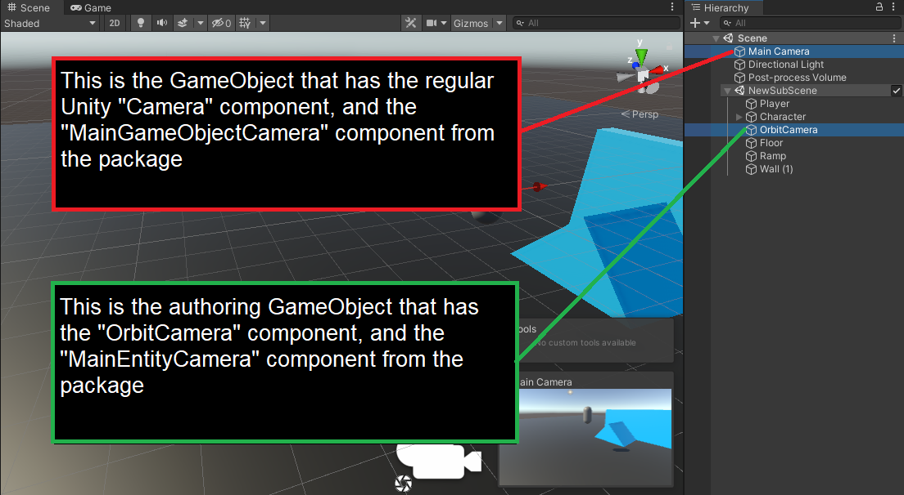

Back to [Tutorial](../tutorial.md)

# Tutorial - Camera Setup

Now we will set up a simple camera. You can start by downloading the Simple Camera .zip available here. It contains all the files needed to create a basic orbit camera:

[Download](../Downloads/Rival_SimpleCamera.zip)

We won't go over the camera code in detail, but here is a summary of how it works:
- Since Unity's `Camera` component cannot be converted to DOTS yet, we need to come up with a way to keep the camera GameObject in the scene, but make it copy the transform of an Entity that represents the camera.
- A `MainCameraSystem` will look for an entity that has the "MainCamera" component, and constantly copy its rotation to whatever Transform is assigned to `MainCameraSystem.CameraGameObjectTransform`.
- The `RegisterAsMainCameraBehaviour` monobehaviour can be added to a GameObject with a `Camera` component to automatically assign it to `MainCameraSystem.CameraGameObjectTransform`
- The `MainCameraAuthoring` component can be assigned to an Entity in a Subscene to mark it as the main camera on the Entities side
- The `OrbitCamera` component, `OrbitCameraInputs` component, and `OrbitCameraSystem` handle the orbit camera's logic and movement

And now here are the steps required to set up the camera in this tutorial scene:
- Add the "Simple Camera" files to your project (download link above)
- Create a new GameObject in the Subscene, and call it "OrbitCamera"
- Add an `OrbitCameraAuthoring` and `MainCameraAuthoring` to that "OrbitCamera" GameObject
- In the `OrbitCameraAuthoring` component, assign the character GameObject (or a child object of the character) to the `InitialFollowedObject` field. This represents which object the camera will be following
- In the `OrbitCameraAuthoring` component, assign the character GameObject (the one with the `PhysicsShape` component) to the `IgnoredEntities` List. This represents which objects the camera will ignore in its camera obstruction checks
- Add a `RegisterAsMainCameraBehaviour` component to the GameObject that has Unity's `Camera` component

This should take care of setting up the camera. If you press Play now, you should have a camera that is centered on your character. However, nothing is controllable yet. We'll add input handling in the next section.
