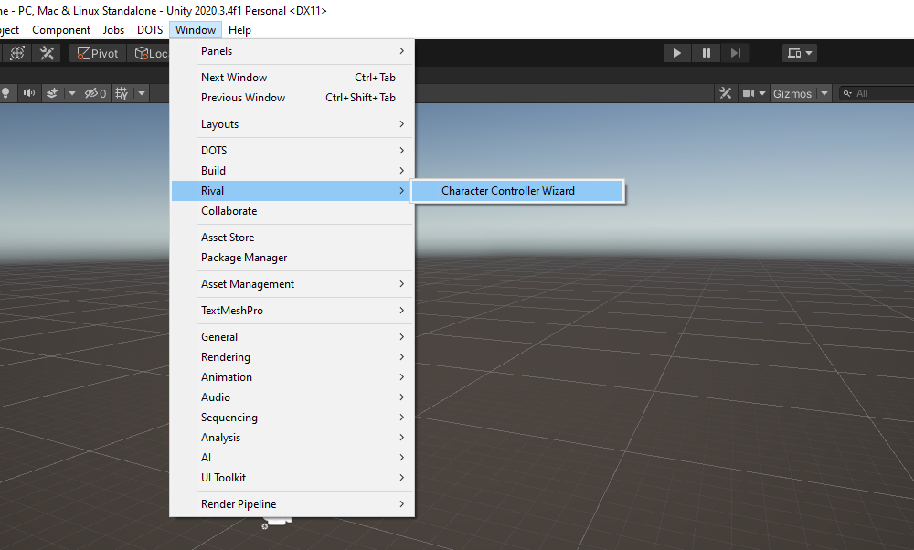
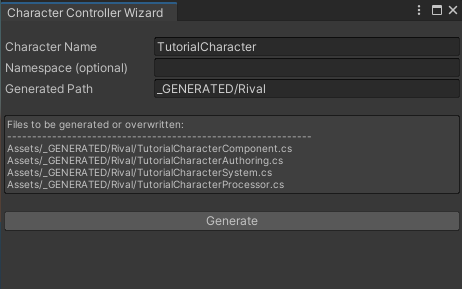
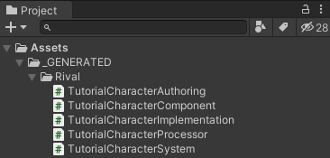

Back to [Tutorial](../tutorial.md)

# Tutorial - Character Creation

There are two main steps to creating a new character controller in Rival:
- Generate the character code
- Assign the generated character authoring component to a GameObject

This section will go over those steps in more details:

## Generating Character Code

- Open up the Character Creation Wizard by going to "Window > Rival > Character Controller Wizard"

- Give a name to your character. Here we will choose "TutorialCharacter"
- Either leave the "Namespace Name" blank, or give it a name
- Leave the "Generated Path" as it is (you will still be able to just move the generated files manually after, so you never truly need to change this path)
- Press the "Generate" button

- You should now see the generated files in your project, under "Assets/_GENERATED/Rival"

Note: once your character files are generated, you can safely move them to another folder, edit them, rename them, etc.... but remember that re-generating the files with the same path and character name will overwrite your changes.

Refer to the [Getting Started](../index.md) and [Code Structure](../Core/code-structure.md) sections for an explanation of what the generated files do

## Creating the Character Authoring GameObject

- In a Unity scene, create a new DOTS Subscene for your character GameObject to be in

- Add an empty GameObject to that Subscene. You can name it "Character"
- Add the generated `TutorialCharacterAuthoring` component to that "Character" GameObject. This will also automatically add a `PhysicsShape` component
- Add a child "Capsule" mesh object to this "Character" object, and make sure to *remove the default "Capsule Collider" component* that comes with it
- In the `PhysicsShape` component on the "Character" object, set the "Shape Type" to "Capsule", and click "Fit to Enabled Render Meshes"

- Add a scaled box with a Box `PhysicsShape` to the Subscene to make a floor
- Position the scene's camera in a way where it's looking at the character

At this point, the character is all set-up. You can press Play and it should fall on the floor by itself. However, since we don't have any input handling yet, it won't be controllable.

