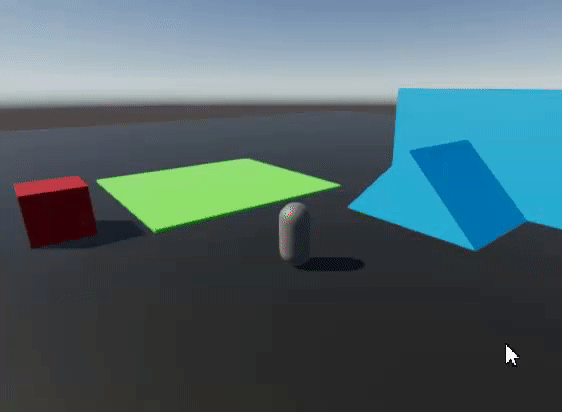

# Tutorial - Friction Surface

We want to be able to create surfaces where the character has a limited movement speed. To do this, we will first create a new `CharacterFrictionSurface` component:

```cs
[Serializable]
[GenerateAuthoringComponent]
public struct CharacterFrictionSurface : IComponentData
{
    public float VelocityFactor;
}
```

Then, we need to make that component accessible from our `TutorialCharacterImplementation.BeforeCharacterMove`.

In `TutorialCharacterSystem`, we will do the following:
- Add a `public ComponentDataFromEntity<CharacterFrictionSurface> CharacterFrictionSurfaceFromEntity;` field to both the `TutorialCharacterJob` and the `TutorialCharacterUpdateData`
- In `TutorialCharacterSystem.OnUpdate`, when scheduling the job, assign the proper data to "CharacterFrictionSurfaceFromEntity" with `CharacterFrictionSurfaceFromEntity = GetComponentDataFromEntity<CharacterFrictionSurface>(true),`
- In `TutorialCharacterJob`, when we create the `TutorialCharacterUpdateData` struct, assign `TutorialCharacterJob.CharacterFrictionSurfaceFromEntity` to `TutorialCharacterUpdateData.CharacterFrictionSurfaceFromEntity`

At this point, we are ready to use the `CharacterFrictionSurfaceFromEntity` in our character movement implementation in `TutorialCharacterImplementation.BeforeCharacterMove`. Look for the `// here` comment:

```cs
public static class TutorialCharacterImplementation
{
    public static void BeforeCharacterMove(ref TutorialCharacterUpdateData d)
    {
        if (d.CharacterBody.IsGrounded)
        {
            // Move on ground
            float3 targetVelocity = d.CharacterInputs.WorldMoveVector * d.TutorialCharacter.GroundMaxSpeed;

            if(d.CharacterInputs.Sprint)
            {
                targetVelocity *= d.TutorialCharacter.SprintSpeedMultiplier;
            }

            // here
            // Modify final velocity based on friction surface
            if(d.CharacterFrictionSurfaceFromEntity.HasComponent(d.CharacterBody.GroundHit.Entity))
            {
                targetVelocity *= d.CharacterFrictionSurfaceFromEntity[d.CharacterBody.GroundHit.Entity].VelocityFactor;
            }

            CharacterControlUtilities.StandardGroundMove_Interpolated(ref d.CharacterBody.RelativeVelocity, targetVelocity, d.TutorialCharacter.GroundedMovementSharpness, d.CommonData.DeltaTime, d.CharacterUp, d.CharacterBody.GroundHit.Normal);

            // Jump
            if (d.CharacterInputs.JumpRequested)
            {
                CharacterControlUtilities.StandardJump(ref d.CharacterBody, d.CharacterUp * d.TutorialCharacter.JumpSpeed, true, d.CharacterUp);
            }

            // (...............)
        }
    }
}
```

Finally, you can add a new box object to the Subscene, with a Box `PhysicsShape`, and a `CharacterFrictionSurface` component. If you set the `VelocityFactor` to something like 0.2 on that `CharacterFrictionSurface` and you press Play, you should see your character move much slower on that surface.

