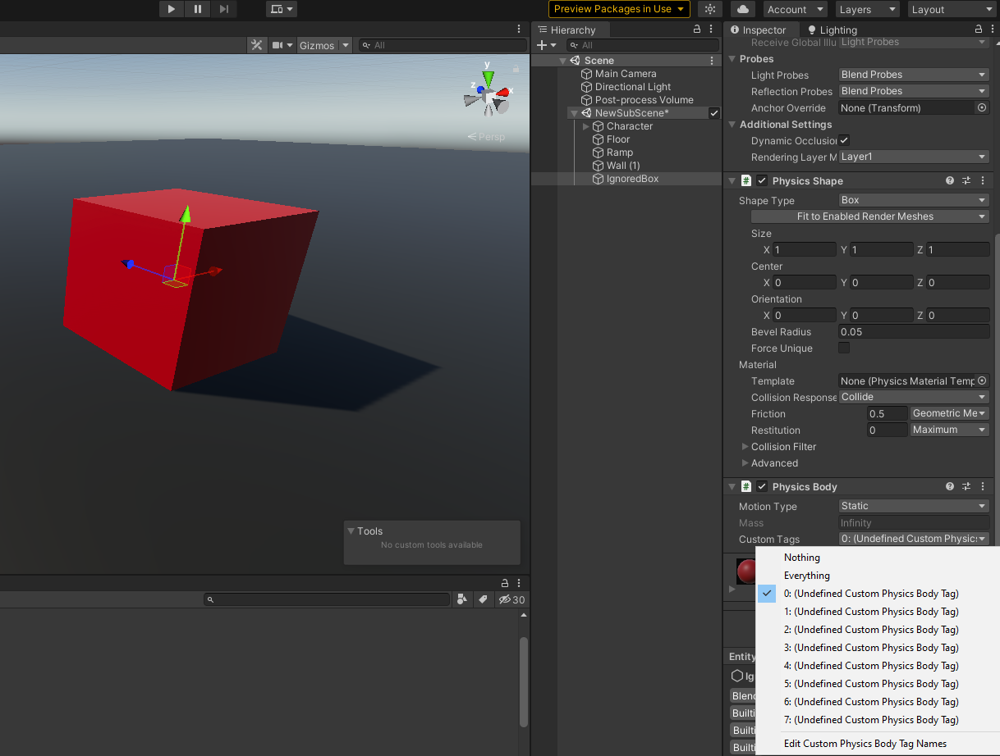
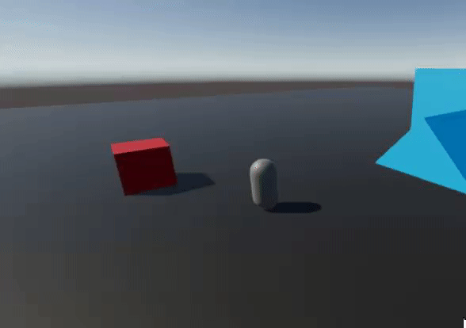

Back to [Tutorial](../tutorial.md)

# Tutorial - Ignore Collisions Tag

We want to be able to make the character ignore all collisions with colliders that have a certain physics custom tag. In order to do this, we will add a box with a `PhysicsShape` and a `PhysicsBody` to the Subscene, and we will assign the custom tag '0' to the "Custom Tags" of its `PhysicsBody`:



Next, we will add a field to our `ThirdPersonCharacterComponent` so we can specify which tag we want to ignore collisions with. You will have to add `using Unity.Physics.Authoring;` at the top of the file for this to work.

```cs
// (...)
using Unity.Physics.Authoring;

[Serializable]
public struct ThirdPersonCharacterComponent : IComponentData
{
    // (...)

    public CustomPhysicsBodyTags IgnoredPhysicsTags;

    // (...)
}
```

Then, we will modify `ThirdPersonCharacterProcessor.CanCollideWithHit` so that it also ignores collisions with colliders that have that physics tag. (You will have to add `using Unity.Physics.Authoring;` at the top of the file for this to work.)

```cs
public struct ThirdPersonCharacterProcessor : IKinematicCharacterProcessor
{
    // (...)

    public bool CanCollideWithHit(in BasicHit hit)
    {
        // First, see if we'd have to ignore based on the default implementation
        if (!KinematicCharacterUtilities.DefaultMethods.CanCollideWithHit(in hit, in CharacterBodyFromEntity))
        {
            return false;
        }

        // if not, check for the ignored tag
        if (ThirdPersonCharacter.IgnoredPhysicsTags.Value > CustomPhysicsBodyTags.Nothing.Value)
        {
            if ((CollisionWorld.Bodies[hit.RigidBodyIndex].CustomTags & ThirdPersonCharacter.IgnoredPhysicsTags.Value) > 0)
            {
                return false;
            }
        }

        return true;
    }
}
```

You can now set the proper ignored tag (tag 0) in your character authoring's inspector, press Play, and try to collide with the box marked with the ignored tag. You should go right through. 




Note 1: if we wanted to, we could ignore collisions based on the presence of a component instead of on a physics tag. All we would have to do is to give our `ThirdPersonCharacterProcessor` a `ComponentDataFromEntity<MyCharacterIgnoreComponent>`. And instead of checking for the presence of the tag in `ThirdPersonCharacterProcessor.CanCollideWithHit`, we would check for the presence of the component, by using the `ComponentDataFromEntity<MyCharacterIgnoreComponent>`.

Note 2: since the callbacks of the `ThirdPersonCharacterProcessor` can potentially be called multiple times per character per frame, it is always a good idea to try to make their logic as inexpensive as possible. If you can, it is still better to ignore collisions with physics categories instead of by checking for a tag or component. But there are times when procedural collision filtering like this can come in very handy.