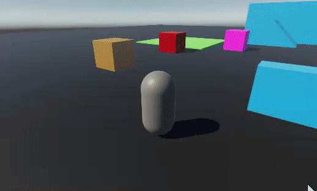

Back to [Tutorial](../tutorial.md)

# Tutorial - Jump Pad (add forces to character)

We will now go over the implementation of a jump pad - a trigger zone that applies a sudden impulse to the character and sends it flying in a direction.

First, we will need to add some files to our project: [Physics Stateful Event Systems](../Downloads/Physics_StatefulEvents.zip). These come from Unity's DOTS samples, and they provide an easy way to get collision/trigger events in DOTS.

Now let's create our `JumpPad` component:
```cs
using System;
using Unity.Collections;
using Unity.Entities;
using Unity.Mathematics;

[Serializable]
[GenerateAuthoringComponent]
public struct JumpPad : IComponentData
{
    public float3 JumpForce;
}
```

Then, add a cube to the Subscene with the following components:
* a box PhysicsShape with a "Raise Trigger Events" collision response
* a `JumpPad`, with its `JumpForce` set to (0, 20f, 0) for example
* a `StatefulTriggerEventBufferAuthoring` (this component is from the downloaded files at the top of this page)

Now let's create our `JumpPadSystem`. See comments in code for explanations:
```cs
using Unity.Burst;
using Unity.Collections;
using Unity.Entities;
using Unity.Jobs;
using Unity.Mathematics;
using Unity.Physics;
using Unity.Physics.Stateful;
using Unity.Physics.Systems;
using Unity.Transforms;
using Rival;

// Update after events processing system 
[UpdateInGroup(typeof(FixedStepSimulationSystemGroup))]
[UpdateAfter(typeof(StatefulTriggerEventBufferSystem))]
public partial class JumpPadSystem : SystemBase
{
    protected override void OnUpdate()
    {
        // Iterate on all jump pads with trigger event buffers
        Entities
            .WithoutBurst()
            .ForEach((Entity entity, in Rotation rotation, in JumpPad jumpPad, in DynamicBuffer<StatefulTriggerEvent> triggerEventsBuffer) =>
            {
                // Go through each trigger event of the jump pad...
                for (int i = 0; i < triggerEventsBuffer.Length; i++)
                {
                    StatefulTriggerEvent triggerEvent = triggerEventsBuffer[i];
                    Entity otherEntity = triggerEvent.GetOtherEntity(entity);

                    // If a character has entered the trigger...
                    if (triggerEvent.State == StatefulEventState.Enter && HasComponent<KinematicCharacterBody>(otherEntity))
                    {
                        KinematicCharacterBody characterBody = GetComponent<KinematicCharacterBody>(otherEntity);

                        // Cancel out character velocity in the jump force's direction
                        // (this helps make the character jump up even if it is falling down on the jump pad at high speed)
                        characterBody.RelativeVelocity = MathUtilities.ProjectOnPlane(characterBody.RelativeVelocity, math.normalizesafe(jumpPad.JumpForce));

                        // Add the jump pad force to the character
                        characterBody.RelativeVelocity += jumpPad.JumpForce;

                        // Unground the character
                        // (without this, the character would snap right back to the ground on the next frame)
                        characterBody.Unground();

                        // Don't forget to write back to the component
                        SetComponent(otherEntity, characterBody);
                    }
                }
            }).Run();
    }
}
```

Now, press Play and move your character through the jump pad. Your character should get pushed into the air

