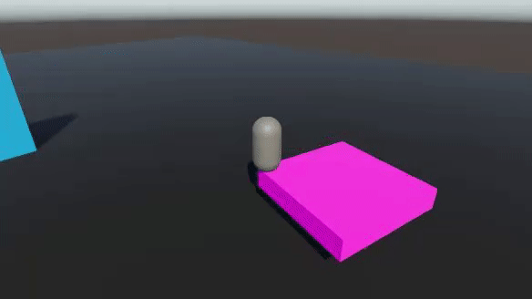

[Tutorial](../tutorial.md)

# Tutorial - Moving platforms

We will now go over how to implement moving platforms in Rival. 

The key points to remember for moving platforms are:
* The moving platform entity must have a `TrackedTransformAuthoring` component (on the same object as the `PhysicsBodyAuthoring` component)
* The moving platform rigidbody must be interpolated too if your character is interpolated
* The moving platform must be moved with its `PhysicsVelocity` for best results

The code for a simple moving platform system is provided here (component & system):

```cs
using System;
using Unity.Collections;
using Unity.Entities;
using Unity.Mathematics;
using UnityEngine;

[Serializable]
[GenerateAuthoringComponent]
public struct MovingPlatform : IComponentData
{
    public float3 TranslationAxis;
    public float TranslationAmplitude;
    public float TranslationSpeed;
    public float3 RotationAxis;
    public float RotationSpeed;

    [HideInInspector]
    public bool IsInitialized;
    [HideInInspector]
    public float3 OriginalPosition;
    [HideInInspector]
    public quaternion OriginalRotation;
}
```

```cs
using Unity.Burst;
using Unity.Collections;
using Unity.Entities;
using Unity.Jobs;
using Unity.Mathematics;
using Unity.Physics;
using Unity.Physics.Systems;
using Unity.Transforms;

[UpdateInGroup(typeof(FixedStepSimulationSystemGroup))]
[UpdateBefore(typeof(BuildPhysicsWorld))]
public class MovingPlatformSystem : SystemBase
{
    protected override void OnUpdate()
    {
        float deltaTime = Time.DeltaTime;
        float invDeltaTime = 1f / deltaTime;
        float time = (float)World.Time.ElapsedTime;

        Entities.ForEach((Entity entity, ref MovingPlatform movingPlatform, ref PhysicsVelocity physicsVelocity, in PhysicsMass physicsMass, in Translation translation, in Rotation rotation) =>
        {
            if(!movingPlatform.IsInitialized)
            {
                // Remember initial pos/rot, because our calculations depend on them
                movingPlatform.OriginalPosition = translation.Value;
                movingPlatform.OriginalRotation = rotation.Value;
                movingPlatform.IsInitialized = true;
            }

            float3 targetPos = movingPlatform.OriginalPosition + (math.normalizesafe(movingPlatform.TranslationAxis) * math.sin(time * movingPlatform.TranslationSpeed) * movingPlatform.TranslationAmplitude);
            quaternion rotationFromMovement = quaternion.Euler(math.normalizesafe(movingPlatform.RotationAxis) * movingPlatform.RotationSpeed * time);
            quaternion targetRot = math.mul(rotationFromMovement, movingPlatform.OriginalRotation);

            // Move with velocity
            physicsVelocity = PhysicsVelocity.CalculateVelocityToTarget(in physicsMass, in translation, in rotation, new RigidTransform(targetRot, targetPos), invDeltaTime);
        }).Schedule();
    }
}

```

This system will make physics bodies move with a given translation & rotation speed at a fixed timestep using a math function. It calculates a `targetPos` and a `targetRot`, and then calls `PhysicsVelocity.CalculateVelocityToTarget` to calculate & apply a physics velocity that would bring the rigidbody to that target position/rotation over the next fixed update. This has nearly the same effect as moving the object direction with position/rotation, but with the added benefit of playing nicely with physics objects (and characters). The fact that it has the correct physics velocity means that it'll accurately apply impulses on other bodies it collides with.

Now, let's set up a moving platform in our scene:
* Create a `MovingPlatform` component and `MovingPlatformSystem` in your project using the code above
* Add a new box with a `PhysicsShape` to your subscene. Call this object "MovingPlatform"
* Make sure that this "MovingPlatform" object also has a `PhysicsBody`. Its `MotionType` must be set to "Kinematic", and its `Smoothing` must be set to "Interpolation"
* Add a `TrackedTransformAuthoring` component to the "MovingPlatform"
* Set some parameters in the `MovingPlatform` component


At this point, you can press Play and jump onto the moving platform. Your character should be able to stand on it



### Additional Notes
* If you want your character to be able to stand on a dynamic rigidbody, simply add a `TrackedTransformAuthoring` component to that rigidbody
* If you really don't want to have to manually add a `TrackedTransformAuthoring` component to everything that a character can stand on, you could choose to write a job that iterates on all entities that have a `PhysicsVelocity` but **don't** have a `TrackedTransformAuthoring`, and then add a `TrackedTransformAuthoring` on those
* Even though it is recommended to move kinematic moving platforms with their `PhysicsVelocity` for accurate physics interactions between the platform and the characters, a moving platform moved directly with `Translation` and `Rotation` can still be stood on nonetheless if it has a `TrackedTransformAuthoring` component. It's just that the pushing and being pushed logic between the platform and the character will be flawed because it won't take impulses into account
