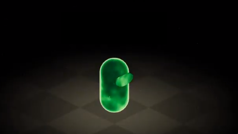
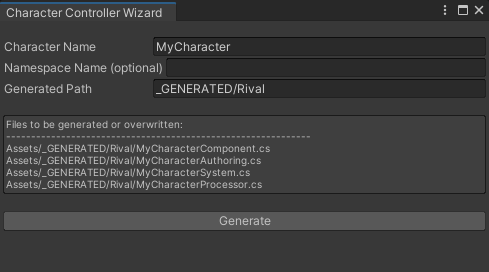

# Getting Started

You can get Rival on the Unity Asset Store: [Link](https://assetstore.unity.com/packages/slug/195567)

This package is verified for Unity 2020.3, and it is recommended that you use only that version for the time being. This is the version recommended by Unity for DOTS development, until further notice.

In Rival, the recommended way to get started implementing your own character is by doing these steps:
- Generate the code for your new character by using the **Character Controller Wizard** window. 
- Add the generated character authoring component to a GameObject.
- Customize the character's implementation inside of the generated files, and/or in extra systems.

## Character Controller Wizard

The **Character Controller Wizard** is a window that allows you to generate all the files necessary for the creation of a new character controller. It can be accessed through Unity's top bar menu: **"Window > Rival > Character Controller Wizard"**. 

You can specify the name, namespace (optional), and path of the generated character controller files, and an info box gives you a preview of what exactly will be generated. Once you've entered a name, namespace, and path, click the "Generate" button to create the files.

See [Code Structure](./Core/code-structure.md) for an overview of what the generated files do.

## Useful Links

See [Tutorial](./tutorial.md) for a guided step-by-step tutorial on creating and customizing a new character from scratch.

See [Samples](./samples.md) for a sample project containing various games and test scenes made using Rival.

See [Core](./core.md) for an in-depth overview of the core components & systems. 

See [How To](./how-to.md) for explanations on how to implement various character features.

See [Tips](./tips.md) for a list of particularities to be aware of, and performance tips.
