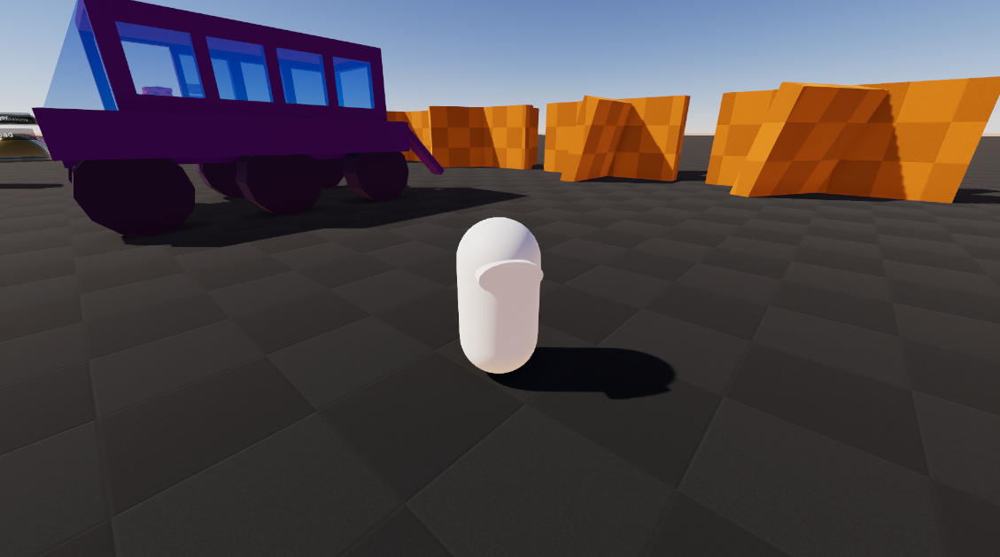
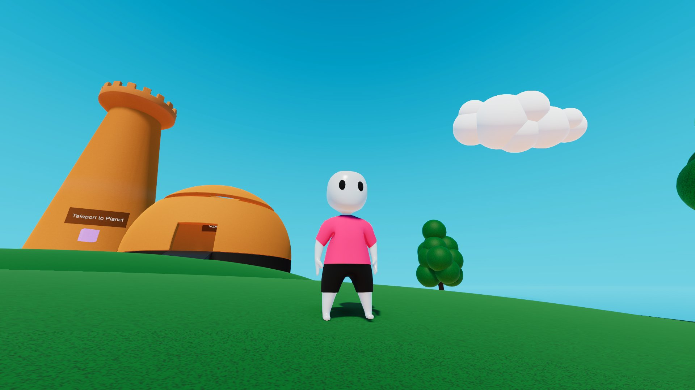
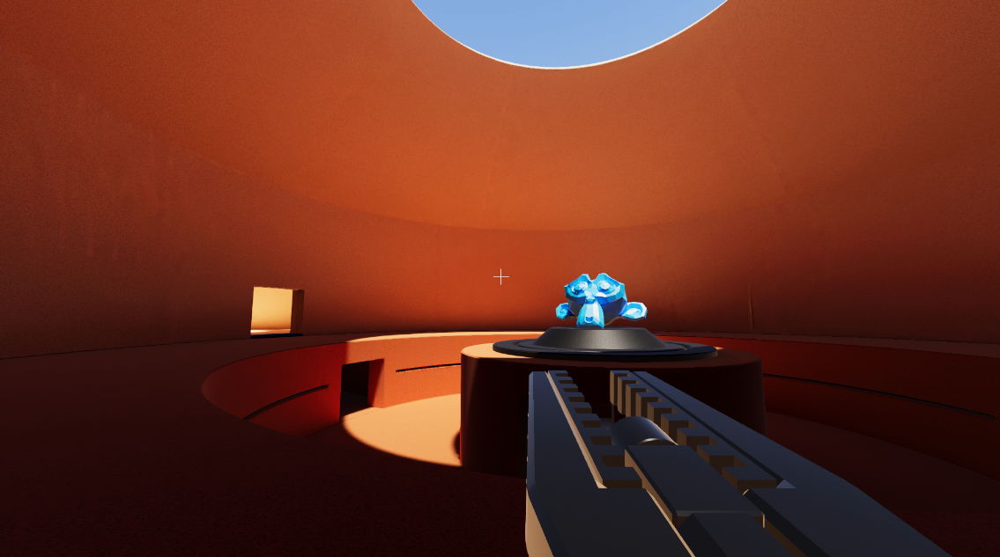
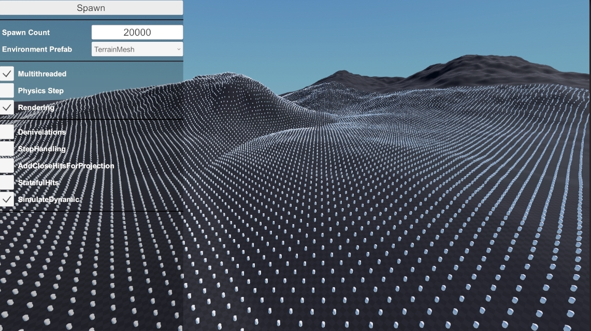

# Samples

Here are the steps required in order to install the Rival Samples project:
1. Create a completely new Unity project, using either the “3D” or “URP” template. You can call this project “RivalSamples” for example.
1. In “Edit > Project Settings > Player”, set the “Active Input Handling” to “Both”. A restart of the editor will be required at this point.
1. Import the Rival package into this project.
1. In the “Rival/Samples” folder, open “RivalSamples.unitypackage”. WARNING: this will completely overwrite the project settings and dependencies.
1. This will start the process of overwriting your project with the Rival Samples project.
1. Once finished, all samples will be under the “Rival_Samples” folder. Each sample has its own sub-folder.

Each sample has its own folder in the project, and a "Common" folder holds scripts and assets that are common throughout several samples.

## Basic Sample

This sample provides a basic character controller and a scene containing a wide variety of obstacles and scenarios: slopes, terrain-like surfaces, dynamic bodies, moving platforms, controllable dynamic vehicle, etc... You can launch the game from the "Basic" scene.
- [Game Initialization](./Samples/BasicSample/game-initialization.md)
- [Character](./Samples/BasicSample/character.md)
- [Camera](./Samples/BasicSample/camera.md)
- [Input](./Samples/BasicSample/input.md)
- [Vehicle](./Samples/BasicSample/vehicle.md)

## Platformer Sample

This sample demonstrates a complex character controller with a wide variety of states, as well as animation. You can launch the game from the "Platformer" scene.
- [Game Initialization](./Samples/PlatformerSample/game-initialization.md)
- [Character](./Samples/PlatformerSample/character.md)
- [Camera](./Samples/PlatformerSample/camera.md)
- [Inputs](./Samples/PlatformerSample/input.md)
- [Animation](./Samples/PlatformerSample/animation.md)

## OnlineFPS Sample

This sample demonstrates a fast-paced, client-predicted online FPS game implemented with DOTS Netcode. You can launch the game from the "OnlineFPSMenu" scene.
- [Hosting & Connecting](./Samples/OnlineFPSSample/hosting-connecting.md)
- [Game Management](./Samples/OnlineFPSSample/game-management.md)
- [Character & Camera](./Samples/OnlineFPSSample/character-and-camera.md)
- [Input & Commands](./Samples/OnlineFPSSample/input-and-commands.md)
- [Weapons](./Samples/OnlineFPSSample/weapons.md)

## StressTest Sample

This sample provides you with a simple scene where you can spawn X amount of characters that move in circles. There are also options for switching the level prefab, and tweaking various character settings that commonly affect performance. You can launch the game from the "StressTest" scene.
- [Overview](./Samples/StressTestSample/overview.md)